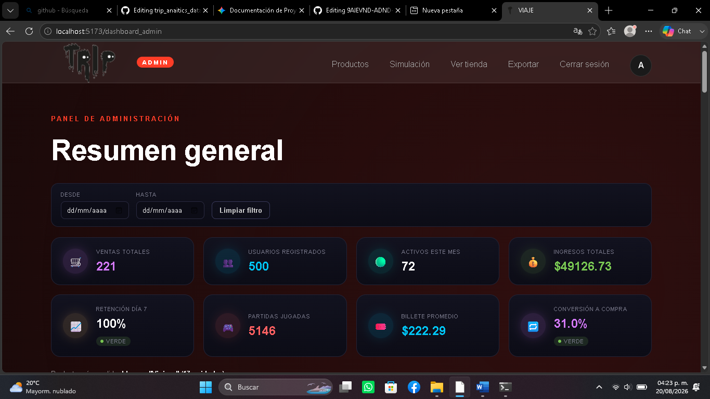
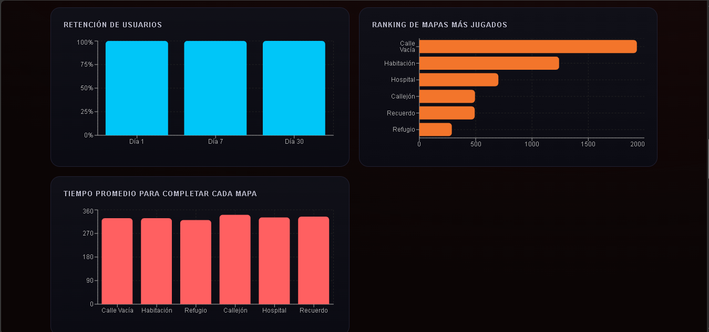
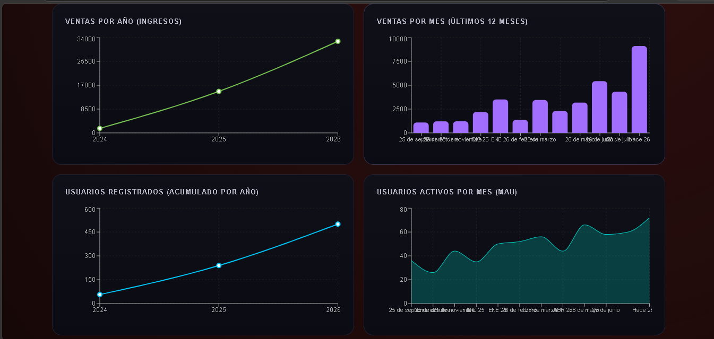
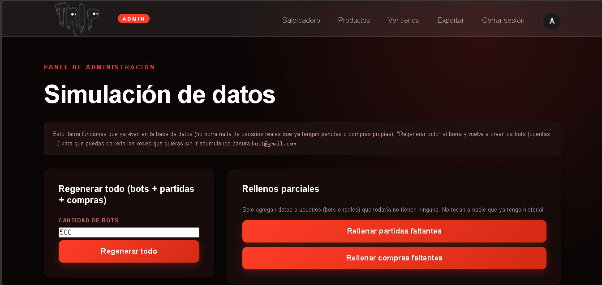
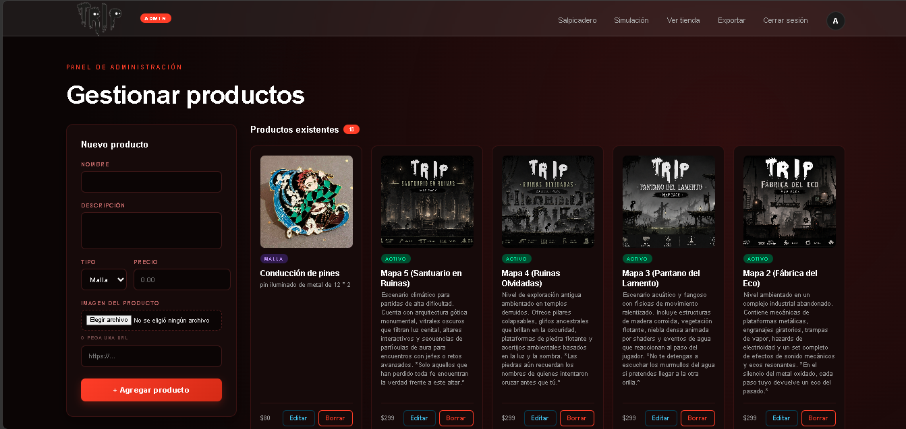
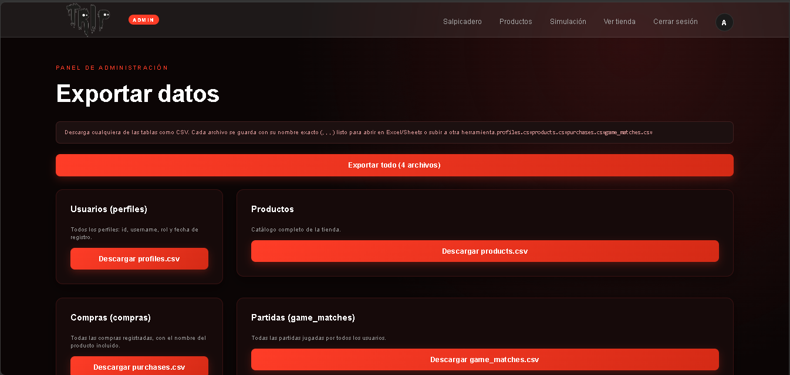

# TRIP

TRIP es un videojuego narrativo 2D desarrollado por Pixel Path. El proyecto integra una experiencia de juego, una tienda digital y dashboards de analítica para estudiar el comportamiento de los jugadores y las compras de contenido digital.

Este repositorio contiene la aplicación web y la simulación de datos utilizada para evaluar el desempeño del producto digital.

## Información académica

- **Programa educativo:** Ingeniería en Entornos Virtuales y Negocios Digitales
- **Cuatrimestre:** Noveno
- **Modalidad:** Proyecto colaborativo
- **Producto final:** Solución analítica aplicada a un negocio digital
- **Equipo:** Cristian Isacc Moreno Jiménez, Juan Manuel Catarino Barrios, Andrea Peña Leal, Brandon Diego Islas Lizardi, Luis Dario Mendoza Morales 
- **Repositorio:** [URL de GitHub](https://github.com/Isacc-Mex/trip_anaitics_datas)
- **Aplicación publicada:** Completar con la URL de despliegue, si existe

## Capturas de Pantalla del Dashboard y Panel de Administración

### 1. Resumen General e Indicadores Clave

*Vista principal del panel de administración con KPIs de ventas, retención, conversión y partidas.*

### 2. Comportamiento, Retención e Ingresos
| Retención y Ranking de Mapas | Evolución de Ingresos y MAU |
| :---: | :---: |
|  |  |
*Gráficos de retención (D1, D7, D30), mapas más jugados, tiempos promedio.* | *Graficas de ingresos acumulados y usuarios.*

### 3. Módulos de Control y Gestión

#### Simulación de Datos

*Panel para ejecutar funciones SQL de simulación de bots, partidas y compras.*

#### Gestión del Catálogo

*Interfaz para agregar, editar y administrar productos digitales y físicos.*

#### Exportación de Datos

*Módulo de descarga de tablas principales (profiles, products, purchases, game_matches) en formato CSV.*

## Documentación del Proyecto

| # | Documento | Archivo | Formato |
| :-: | :--- | :--- | :-: |
| **1.** | Documentación Técnica | [Documentacion_Tecnica.pdf](docs/Documentacion_Tecnica.pdf) | PDF |
| **2.** | Hallazgos, Diagnóstico y Recomendaciones | [Hallazgos_Diagnostico_Recomendaciones_TRIP_FINAL_VALIDADO.pdf](docs/Hallazgos_Diagnostico_Recomendaciones_TRIP_FINAL_VALIDADO.pdf) | PDF |
| **3.** | Uso de Inteligencia Artificial | [ai-usage.pdf](docs/ai-usage.pdf) | PDF |
| **4.** | Contexto del Proyecto | [context.md](docs/context.md) | Markdown |
| **5.** | Proceso ETL | [etl-process.md](docs/etl-process.md) | Markdown |
| **6.** | Indicadores Clave (KPIs) | [kpis.pdf](docs/kpis.pdf) | PDF |
| **7.** | Manual de Usuario | [manual-usuario.pdf](docs/manual-usuario.pdf) | PDF |
| **8.** | Reporte Ejecutivo | [reporte-ejecutivo.pdf](docs/reporte-ejecutivo.pdf) | PDF |
| **9.** | Reglas de Simulación | [simulation-rules.pdf](docs/simulation-rules.pdf) | PDF |

## Contexto del negocio

TRIP es un negocio digital de entretenimiento. Sus usuarios pueden registrarse, jugar partidas, consultar su progreso y adquirir contenido digital desde una tienda integrada.

### Problema de negocio

El equipo necesita comprender cómo interactúan los jugadores con el videojuego y cómo esa interacción se relaciona con la monetización. Se analizarán usuarios recurrentes, actividad por periodo, productos con más compras, mapas más jugados y oportunidades para mejorar la retención y la conversión a compra.

### Objetivo analítico

Analizar el comportamiento de los jugadores, sus partidas y sus compras mediante datos almacenados en Supabase para identificar patrones de actividad, retención y monetización que apoyen decisiones de producto, contenido y comercialización.

### Objetivo general

Procesar, analizar e interpretar la información del videojuego TRIP mediante herramientas de analítica de datos para identificar tendencias, patrones, métricas e indicadores que apoyen la toma de decisiones del negocio digital.

### Objetivos específicos

- Describir el comportamiento de los jugadores y sus sesiones de juego.
- Identificar patrones de retención, actividad y progreso.
- Analizar la relación entre participación en el juego y compras digitales.
- Definir KPI que permitan evaluar el desempeño del negocio.
- Proponer recomendaciones sustentadas en datos.

### Preguntas de negocio

1. ¿Cuántos usuarios están activos durante cada mes?
2. ¿Qué proporción de usuarios regresa durante los días 1, 7 y 30?
3. ¿Cómo evolucionan las compras y los ingresos a través del tiempo?
4. ¿Qué productos son los más vendidos?
5. ¿Qué mapas concentran más partidas?
6. ¿En qué días y horarios se concentra la actividad?
7. ¿Cómo cambia el comportamiento entre jugadores nuevos y recurrentes?
8. ¿Qué oportunidades existen para mejorar la retención y la monetización?

### Alcance y limitaciones

El análisis cubre perfiles, partidas, progreso, productos y compras registradas en Supabase. Actualmente los ingresos no incluyen costos, utilidad ni margen; la simulación vive principalmente en SQL; no existe aún un pipeline ETL independiente; y los hallazgos definitivos dependen de la validación del dataset final.

## Flujo general de trabajo

```text
Contexto económico del videojuego
              |
              v
Problema y preguntas de negocio
              |
              v
Entidades, atributos y fuentes de datos
              |
              v
Simulación estratégica del dataset
              |
              v
Proceso ETL y control de calidad
              |
              v
Análisis exploratorio de datos
              |
              v
Mecanismo analítico de retención y monetización
              |
              v
Definición y cálculo de KPI
              |
              v
Dashboard del dueño
              |
              v
Dashboard del jugador
              |
              v
Diagnóstico y recomendaciones
              |
              v
Documentación, GitHub, despliegue y defensa
```

## Stakeholders y usuarios

- **Dueño o administrador:** consulta ingresos, ventas, usuarios activos, retención y actividad general.
- **Responsable de producto:** analiza mapas, duración, dificultad y progreso.
- **Responsable de marketing:** observa registros, recurrencia y compras.
- **Jugador:** consulta sus partidas, tiempos, progreso y estadísticas personales.
- **Desarrollador:** mantiene la aplicación y la integración con Supabase.
- **Analista de datos:** valida calidad, métricas y resultados.

## Funcionalidades actuales

- Registro, inicio de sesión y recuperación de contraseña.
- Perfiles con roles de jugador y administrador.
- Juego narrativo y almacenamiento de partidas.
- Tienda de productos digitales y registro de compras.
- Dashboard personal del jugador.
- Dashboard administrativo con métricas generales.
- Simulación de bots, partidas y compras mediante funciones SQL.
- Actualización en tiempo real de nuevas partidas del jugador.
- Administración de productos e imágenes.

## Arquitectura

```text
Usuario / Administrador
          |
          v
Aplicación React + Vite
          |
          v
Supabase Auth, PostgreSQL, Storage y Realtime
          |
          +--> perfiles, productos, compras y partidas
          +--> funciones SQL de simulación
          |
          v
Dashboards de jugador y administrador
```

Documentación disponible:

- [Contexto, problema y objetivos](docs/context.md)
- [Reporte ejecutivo](docs/reporte-ejecutivo.pdf)
- [Manual de usuario](docs/manual-usuario.pdf)
- [Documentación técnica consolidada: diccionario, entidades y fuentes](docs/Documentacion_Tecnica.pdf)
- [Reglas y script de simulación](docs/simulation-rules.pdf)
- [Notebook de análisis exploratorio](notebooks/eda.ipynb)
- [Proceso ETL](docs/etl-process.md)
- [Reporte de calidad](docs/quality-report.md)
- [Catálogo de KPI](docs/kpis.pdf)
- [Documentación técnica del proyecto](docs/technical-documentation.md)
- [Registro de uso de IA](docs/ai-usage.pdf)
- [Hallazgos, diagnóstico y recomendaciones](docs/findings.md)
- [Organización de datos raw y processed](data/README.md)
| Funciones SQL de simulación | SQL | Simulado | Generación de datos de prueba |
| Supabase Realtime | Eventos | Datos en movimiento | Actualización de nuevas partidas |

Actualmente el proyecto utiliza una fuente persistente, una fuente simulada y eventos en tiempo real. La formalización de exports CSV/JSON como fuentes independientes queda pendiente para documentar tres fuentes con mayor claridad.

| Entidad | Propósito | Campos relevantes |
| --- | --- | --- |
| `profiles` | Perfil y rol del usuario | `id`, `username`, `role`, `created_at` |
| `products` | Catálogo de la tienda | `id`, `name`, `type`, `price`, `image_url` |
| `purchases` | Compras digitales | `id`, `user_id`, `product_id`, `price_paid`, `created_at` |
| `game_matches` | Historial de partidas | `user_id`, `played_at`, `duration_seconds`, `death_type`, `map_name` |
| `leaderboard_best_times` | Mejores tiempos publicados | usuario, mapa, tiempo y fecha |
| `progress` | Progreso del jugador | usuario y avance dentro del juego |

Los datos son estructurados, históricos y parcialmente simulados. Los datos reales deben protegerse mediante las políticas RLS de Supabase.

## Simulación de datos

La simulación se encuentra en [supabase_setup_simulacion.sql](supabase_setup_simulacion.sql). Incluye crecimiento no uniforme, actividad de fin de semana, segmentos de jugadores, abandono entre mapas, duraciones diferentes y una proporción de jugadores que realiza compras.

Funciones principales: `admin_run_full_simulation`, `admin_fill_missing_gameplay`, `admin_fill_missing_purchases`, `admin_regenerate_bots`, `simulate_player_matches` y `simulate_player_purchases`.

La semilla reproducible, el dataset exportable de mínimo tres años, los datasets raw/processed y el proceso ETL independiente son pendientes académicos.

## Indicadores y dashboards

### Dashboard del administrador

Ventas e ingresos por año y mes, usuarios registrados, usuarios activos del mes, retención del día 7, partidas jugadas, usuarios nuevos frente a recurrentes, tipos de muerte, duración promedio, consumo promedio, mapas más jugados y actividad por día y hora.

### Dashboard del jugador

Tiempo total, mejor tiempo, partidas, muertes, uso por día, intentos y tiempo por mapa, consumos, daño recibido, progreso de mejora, historial semanal y mejores tiempos globales.

Estas son métricas implementadas. El catálogo formal de KPI todavía debe agregar fórmula, objetivo, fuente, periodicidad, meta, semáforo, responsable e interpretación.

## Resultados, diagnóstico y recomendaciones

Los resultados definitivos deben completarse después de ejecutar la simulación final y validar los datos.

### Hallazgos

1. Completar con un hallazgo respaldado por datos.
2. Completar con un hallazgo respaldado por datos.
3. Completar con un hallazgo respaldado por datos.

### Recomendaciones

1. Completar con una acción relacionada con el primer hallazgo.
2. Completar con una acción relacionada con el segundo hallazgo.
3. Completar con una acción relacionada con el tercer hallazgo.

Estos marcadores deben sustituirse por resultados verificados antes de entregar el proyecto.

## Tecnologías

- React 19, Vite y React Router.
- Recharts para visualizaciones.
- Supabase Auth, PostgreSQL, Storage y Realtime.
- ESLint para validación estática.

## Requisitos e instalación

- Node.js 20 o superior.
- npm.
- Proyecto de Supabase con tablas, políticas RLS, triggers y vistas configuradas.

```bash
npm install
```

Crea un archivo `.env` en la raíz:

```env
VITE_SUPABASE_URL=https://tu-proyecto.supabase.co
VITE_SUPABASE_ANON_KEY=tu_clave_publica_de_supabase
```

Después configura Supabase y ejecuta [supabase_setup_simulacion.sql](supabase_setup_simulacion.sql) en el SQL Editor. No subas contraseñas, tokens privados ni archivos `.env` al repositorio.

## Ejecución

```bash
npm run dev
npm run lint
npm run build
npm run preview
```

## Rutas principales

| Ruta | Acceso | Descripción |
| --- | --- | --- |
| `/` | Público | Inicio |
| `/juego` | Público | Presentación del videojuego |
| `/registro` | Público | Creación de cuenta |
| `/login` | Público | Inicio de sesión |
| `/tienda` | Público/autenticado | Catálogo y compras |
| `/dashboard` | Jugador | Estadísticas personales |
| `/dashboard_admin` | Administrador | Analítica general |
| `/admin` | Administrador | Administración de productos |
| `/admin/simulacion` | Administrador | Generación de datos |


## Privacidad y seguridad

- Las rutas administrativas requieren sesión y rol `admin`.
- Las consultas dependen de las políticas RLS de Supabase.
- El dashboard del jugador debe consultar solo sus propias partidas y compras.
- No deben exponerse credenciales, tokens privados ni datos sensibles.
- El leaderboard debe revisarse para confirmar que mostrar nombres públicos sea compatible con la política de privacidad.

## Estado de cumplimiento

### Implementado o parcial

- Contexto funcional de videojuego digital.
- Entidades principales y almacenamiento en Supabase.
- Simulación estratégica básica.
- Dashboard de dueño y dashboard de cliente.
- Métricas de actividad, ingresos y retención.
- Prototipo de actualización en tiempo real.

### Pendiente

- Diccionario de datos, modelo de entidades y fuentes documentados en `docs/Documentacion_Tecnica.pdf`.
- Dataset raw/processed y semilla reproducible.
- ETL, perfilado y validaciones.
- Notebook EDA y mecanismo analítico.
- Catálogo formal de KPI.
- Diagnóstico, hallazgos y recomendaciones reales.
- Documentación técnica y registro de IA disponibles en PDF.
- Evidencias de GitHub, presentación y defensa.

## Secuencia recomendada de trabajo

| Fase | Actividades | Estado |
| --- | --- | --- |
| 1 | Contexto, problema, stakeholders y preguntas | Parcial |
| 2 | Entidades, atributos, fuentes y diccionario | Parcial |
| 3 | Reglas, generación y validación | Parcial |
| 4 | Extracción, transformación y carga | Pendiente |
| 5 | Calidad, estadística, gráficas y tendencias | Parcial |
| 6 | Método de diagnóstico o estimación | Pendiente |
| 7 | Métricas, KPI, metas y alertas | Parcial |
| 8 | Dashboard del dueño y del jugador | Parcial |
| 9 | Hallazgos, conclusiones y recomendaciones | Pendiente |
| 10 | Documentación, GitHub y despliegue | Parcial |
| 11 | Presentación y demostración | Pendiente |
| 12 | Actualización web en tiempo real | Parcial |

## Entregables

- [o] Contexto, problema, objetivos, preguntas y stakeholders.
- [o] Modelo de entidades, fuentes y diccionario de datos.
- [x] Reglas y script de simulación.
- [x] Dataset original y procesado.
- [x] ETL y reporte de calidad.
- [x] Notebook EDA.
- [x] Mecanismo analítico.
- [x] Catálogo de KPI.
- [x] Dashboard del dueño.
- [x] Dashboard del jugador.
- [o] Hallazgos, diagnóstico y recomendaciones.
- [x] Reporte ejecutivo y manual de usuario.
- [x] README del proyecto.
- [x] Documentación técnica y registro de IA.
- [x] Evidencias de GitHub.
- [ ] Presentación y demostración.
- [x] Aplicación en tiempo real, si se solicita la bonificación.

## Criterios de calidad

El proyecto debe demostrar una relación verificable entre:

```text
Problema -> Datos -> ETL -> Análisis -> KPI -> Hallazgos -> Decisiones
```

El equipo debe poder explicar el origen de los datos, justificar las métricas, validar resultados, reconocer limitaciones y defender sus decisiones.

## Uso de inteligencia artificial

El uso de IA debe registrarse en `docs/ai-usage.md`, incluyendo herramientas, prompts importantes, código generado, cambios, errores, validaciones y decisiones del equipo. Todo contenido generado debe ser comprendido, probado, corregido y defendido por los integrantes.

## Licencia y referencias

La licencia y las referencias utilizadas para decisiones de negocio, analítica, privacidad y tecnologías deben definirse y registrarse antes de publicar el repositorio.
